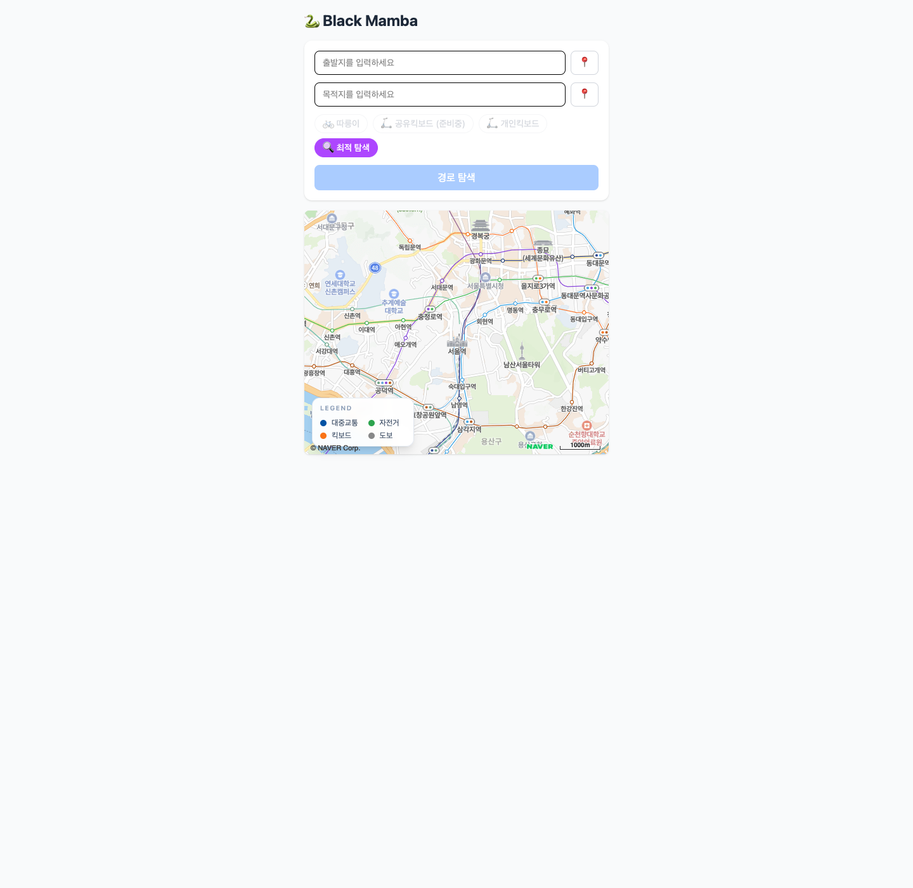
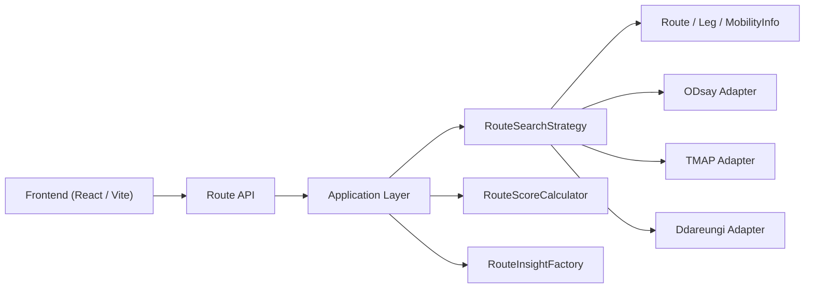
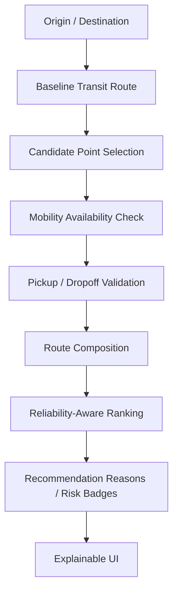

# Hub-Based Reliability-Aware MaaS Routing Engine

대중교통, 공공자전거, 개인 이동수단을 결합해 도착 성공 가능성이 높은 경로를 추천하는 도시형 멀티모달 라우팅 엔진입니다.

## Screenshots

### Main Search



### Route Recommendation


## 1. Project Overview

기존 길찾기 서비스는 주로 최단시간 또는 최단거리 중심으로 경로를 추천합니다.
하지만 실제 도시 이동에서는 다음과 같은 제약이 존재합니다.

- 공유 이동수단은 항상 이용 가능한 것이 아님
- 환승은 아무 지점에서나 자연스럽게 일어나지 않음
- 자전거는 대여 가능 여부뿐 아니라 반납 정류소 존재 여부도 중요함
- 접근 도보가 길면 이론상 최적 경로도 실제로는 불편할 수 있음

이 프로젝트는 이런 현실 제약을 반영해, 단순 ETA가 아니라 실제 이동 성공 가능성이 높은 경로를 추천하는 MaaS 라우팅 엔진을 목표로 합니다.

## 2. Problem Statement

도시 이동은 단순히 "빠른 경로"를 찾는 문제로 끝나지 않습니다.

예를 들어:

- 대중교통만 이용하면 환승은 적지만 도보가 길 수 있음
- 자전거를 결합하면 더 빠를 수 있지만 반납 정류소가 없으면 경로가 성립하지 않음
- 이동수단 접근 도보가 길면 추천 경로라도 실제 선택 확률이 낮아짐
- 실시간 데이터 품질이 불완전하면 이론상 최적 경로가 실제로는 unusable 할 수 있음

따라서 이 프로젝트는 아래 질문을 해결하려고 합니다.

- 어디서 갈아타는 것이 현실적인가?
- 실제로 탈 수 있고 반납할 수 있는가?
- 최단시간보다 더 신뢰도 높은 경로는 무엇인가?

## 3. Core Idea

이 엔진은 두 단계로 경로를 탐색합니다.

### 1) Hub-Based Candidate Generation

대중교통 경로를 baseline으로 만든 뒤, 환승 가능성이 높은 지점과 허브를 후보로 선택합니다.

- baseline 대중교통 경로 생성
- 출발지/목적지 인근 허브 또는 환승 후보 지점 탐색
- 환승 후보 근처 이동수단 가용성 확인
- 자전거는 대여 정류소와 반납 정류소를 모두 검증

### 1.5) Baseline-Guided Multimodal Recomposition

이 프로젝트는 기존 대중교통 경로의 앞뒤 도보만 단순히 자전거로 치환하는 방식에 머무르지 않습니다.
baseline 대중교통 경로를 먼저 만든 뒤, 그 경로를 따라 퍼스트마일/라스트마일 허브 후보를 고르고 새로운 멀티모달 조합을 다시 구성합니다.

예를 들어 baseline이 아래와 같더라도:

- 도보 -> 지하철 A -> 지하철 B -> 도보

엔진은 아래 같은 조합을 만들 수 있습니다.

- 출발지 -> 자전거 -> 다른 허브 -> 버스/지하철 -> 도보

다만 현재는 모든 정류장/허브 조합을 완전 자유 탐색하지는 않습니다.
그 이유는 다음과 같습니다.

- 대중교통 부분 경로를 모든 허브 조합에 대해 다시 조회하면 ODsay/TMAP 호출 수가 급격히 증가함
- 무료 외부 API 플랜에서는 quota와 rate limit이 실제 제약이 됨
- 공유 이동수단 데이터는 품질과 실시간성이 완전하지 않아, 후보를 무한정 넓히는 것이 항상 품질 향상으로 이어지지 않음

그래서 현재 엔진은 `baseline 기반 허브 재조합` 전략을 사용합니다.
즉, baseline 대중교통 경로를 뼈대로 삼고 그 주변의 의미 있는 허브만 선택적으로 재조합해, 호출 수와 품질 사이의 균형을 맞춥니다.

### 2) Reliability-Aware Ranking

생성된 후보 경로를 시간뿐 아니라 다음 요소까지 포함해 평가합니다.

- 총 소요시간
- 총 도보 거리
- 환승 수
- 이동수단 접근 도보 길이
- 공유 이동수단 의존성
- 자전거 반납 정류소 존재 여부
- 가용성 부족 리스크

즉, "가장 빠른 경로"보다 "실제로 성공 가능성이 높은 경로"를 우선 추천하는 방향으로 설계했습니다.

## 4. Key Features

- 대중교통 baseline 경로 생성
- 대중교통 + 자전거 조합 경로 생성
- 이동수단 + 대중교통 조합 경로 생성
- 이동수단 + 대중교통 + 이동수단 조합 경로 생성
- 자전거 대여/반납 정류소 검증
- 이동수단 접근/이탈 도보 구간 반영
- 지도 마커 기반 탑승/환승 설명 UI
- 추천 이유 및 리스크 배지 제공
- 설명 가능한 추천 결과 제공

## 5. System Architecture

- `api`
  - 경로 검색 API 제공
- `application`
  - 경로 탐색 전략, 후보 생성, 점수 계산, 인사이트 생성
- `domain`
  - `Route`, `Leg`, `MobilityInfo` 등 핵심 도메인 모델
- `infra`
  - ODsay, TMAP, 따릉이 등 외부 API 연동
- `frontend`
  - 경로 비교, 지도 시각화, 추천 이유/리스크 노출



## 6. Routing Flow

### Baseline

- 출발지 -> 목적지 대중교통 경로 생성

### Candidate Generation

- baseline 경로에서 라스트마일/퍼스트마일 후보 지점 선택
- 출발지/목적지 인근 이동수단 가용성 조회
- 자전거는 실제 대여 정류소와 반납 정류소를 모두 확인
- 완전 자유 멀티모달 탐색 대신, baseline 주변 허브만 재조합해 외부 API 호출량을 제어

### Route Composition

현재 지원하는 경로 타입:

- `TRANSIT_ONLY`
- `TRANSIT_WITH_BIKE`
- `TRANSIT_WITH_KICKBOARD`
- `MOBILITY_FIRST_TRANSIT`
- `MOBILITY_TRANSIT_MOBILITY`
- `MOBILITY_ONLY`



## 7. Reliability-Aware Recommendation

이 프로젝트는 단순 최단시간 정렬이 아니라, 실제 사용 가능성까지 반영한 추천을 목표로 합니다.

현재 추천에 반영하는 요소:

- 총 소요시간
- 총 도보 거리
- 환승 횟수
- 접근 도보 길이
- 자전거 반납 정류소 존재 여부
- 공유 이동수단 의존도
- 가용성 부족 리스크

추천 결과에는 아래 정보를 함께 제공합니다.

- 왜 추천되었는지
- 어떤 리스크가 있는지
- 어떤 환승 포인트를 거치는지

## 8. Explainable UI

지도와 경로 카드에서 다음 정보를 시각적으로 제공합니다.

- 버스/지하철/자전거/킥보드/도보 구간 구분
- 마커 근처 탑승/환승 라벨
- hover/click 시 상세 정보 팝업
- 추천 이유 배지
- 리스크 배지
- 핵심 환승 포인트 요약
- 디버그 모드 기반 엔진 판단 정보

## 9. Data Sources

- 대중교통 경로: ODsay
- 도보/마이크로모빌리티 구간 좌표: TMAP
- 공공자전거 정류소 및 대여 가능 정보: 서울시 따릉이 API

## 10. API Call Optimization

무료 외부 API의 호출 제한을 고려해 아래 최적화를 적용했습니다.

- `ODsay`: 동일 출발/도착 쌍 route/time 재사용
- `ODsay`: 출발지/도착지 직선거리 700m 이하 구간은 검색을 차단하고 사용자에게 재검색을 유도
- `따릉이`: 전체 정류소 snapshot 캐시 후 반경 필터링만 재계산
- `킥보드`: 전체 기기 snapshot 캐시 후 반경 필터링만 재계산
- `TMAP`: 동일 보행 경로 캐시
- `TMAP`: 429 quota 초과 발생 시 일정 시간 외부 호출을 차단하고 haversine fallback
- `MobilityAvailability`: pickup/dropoff 조회 캐시
- `Hub pruning`: 목적지 기준 이동수단 최대 범위를 벗어난 라스트마일 후보를 사전 제거
- `Candidate deduplication`: 서로 매우 가까운 정류소 후보는 하나로 병합

현재 TTL은 설정값으로 관리합니다.

- `navigation.cache.odsay-route-ttl-ms`
- `navigation.cache.ddareungi-snapshot-ttl-ms`
- `navigation.cache.kickboard-snapshot-ttl-ms`
- `navigation.cache.mobility-availability-ttl-ms`
- `navigation.cache.tmap-pedestrian-route-ttl-ms`
- `navigation.cache.tmap-rate-limit-backoff-ms`

캐시 효과는 `navigation.cache.total{cache=...,result=hit|miss}` metric으로 관찰할 수 있습니다.
외부 API 예외 상황은 아래처럼 처리합니다.

- `ODsay`: 짧은 구간(`<=700m`)은 `400 SHORT_DISTANCE` 응답으로 명시적으로 안내
- `TMAP`: 429 발생 시 backoff 기간 동안 API 호출 생략
- 두 경우 모두 엔진은 fallback 경로/시간 계산으로 동작을 유지

## 11. Tech Stack

### Backend

- Java
- Spring Boot
- Gradle
- Reactor

### Frontend

- React
- Vite
- Naver Map

### Infra / External

- ODsay
- TMAP
- 서울시 따릉이 API

## 12. Run Locally

### Backend

```bash
./gradlew :api:bootRun
```

### Frontend

```bash
cd frontend
npm install
npm run dev
```

기본 포트:

- backend: `8081`
- frontend: `5173`

## 13. Current Implementation Status

현재 구현된 핵심 사항:

- 대중교통 경로를 baseline으로 생성
- 자전거 라스트마일/퍼스트마일 조합 경로 생성
- 실제 대여 정류소 / 반납 정류소 검증
- 이동수단 탑승 전후 도보 구간 반영
- 연속 도보 구간 병합
- 700m 이내 단거리 검색 제한 및 사용자 재검색 안내
- 추천 이유/리스크를 API 응답에 포함
- 지도/카드에서 설명 가능한 추천 UI 제공

## 14. Evaluation Plan

향후 아래 지표를 중심으로 평가할 예정입니다.

- baseline 대비 평균 시간 절감
- 평균 도보 거리 변화
- 접근 도보 평균/최대 거리
- 반납 정류소 미존재로 제외된 경로 비율
- 추천 경로의 공유수단 의존 비율
- API 응답 시간

추가로, 아래 비교를 목표로 합니다.

- 최단시간 중심 추천 vs 신뢰도 중심 추천

배치 실험 스크립트는 추천 결과뿐 아니라 cache hit/miss delta도 함께 기록합니다.

## 15. Limitations

현재 한계:

- 공유 킥보드 실시간 데이터 품질 한계
- 허브 모델이 아직 정류소/후보점 수준에 머무름
- 점수 모델이 완전한 운영 리스크를 모두 반영하진 않음
- 실험 데이터셋 기반 정량 평가가 아직 부족함
- 700m 이내 단거리 구간은 현재 도보 전용 탐색을 제공하지 않음
- 완전 자유 멀티모달 탐색이 아니라 baseline 기반 허브 재조합이기 때문에, baseline 바깥의 유망한 허브 조합을 놓칠 수 있음
- 외부 API quota와 rate limit 때문에 후보를 무한정 확장하는 탐색은 현실적으로 어렵고, 현재는 캐시/백오프/pruning으로 대응 중
- TMAP fallback 상황에서는 도보 관련 지표가 근사치로 계산될 수 있음

## 16. Roadmap

다음 단계는 아래 방향으로 확장할 계획입니다.

### 1) Hub Domain Generalization

- `BikeStation` 수준을 넘어 `Hub` 도메인으로 일반화
- `SUBWAY_STATION`, `BUS_STOP`, `BIKE_STATION`, `CARSHARE_ZONE`, `CHARGING_STATION` 등으로 확장
- 상세 설계 문서: [`docs/plans/2026-03-11-hub-reliability-design.md`](docs/plans/2026-03-11-hub-reliability-design.md)

### 2) Reliability Score Enhancement

- 접근 도보 penalty 고도화
- 공유 이동수단 availability risk 반영
- 경로 실패 가능성 모델 강화

### 3) Automotive-Oriented Extension

- EV charging-aware routing
- PBV / mobility hub 시나리오 확장
- 차량 연계형 multimodal routing 검토

## 16. Why This Project Matters

이 프로젝트는 단순 길찾기 앱이 아니라, 불완전한 실시간 데이터 환경에서 실제 도시 이동의 제약을 다루는 의사결정 엔진을 지향합니다.

특히 아래에 집중했습니다.

- 환승 허브 기반 후보 생성
- 이동수단 가용성과 반납 가능성 검증
- 신뢰도 중심 경로 추천
- 설명 가능한 결과 제공
- 확장 가능한 도메인 구조 설계

자동차/모빌리티 회사 관점에서는, 이 프로젝트를 통해 멀티모달 이동, 허브 기반 환승, 운영 신뢰성, 데이터 제약 환경을 동시에 다루는 백엔드 설계 역량을 보여주는 것을 목표로 합니다.
