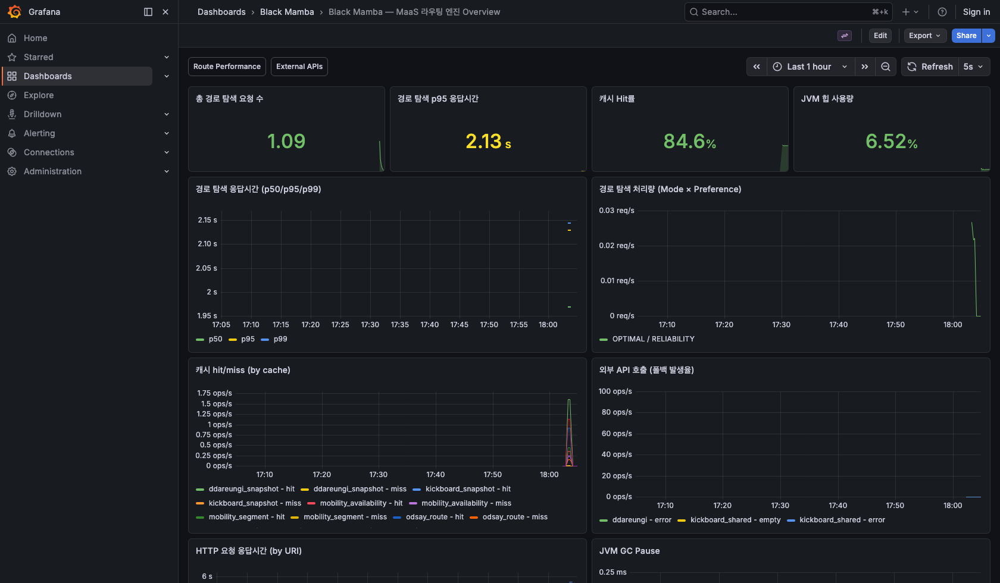
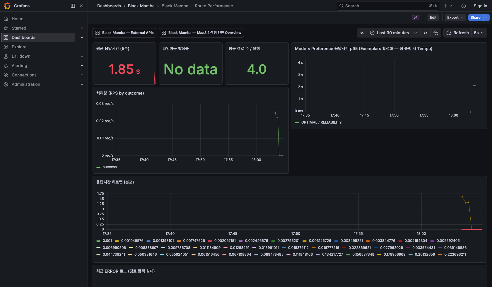
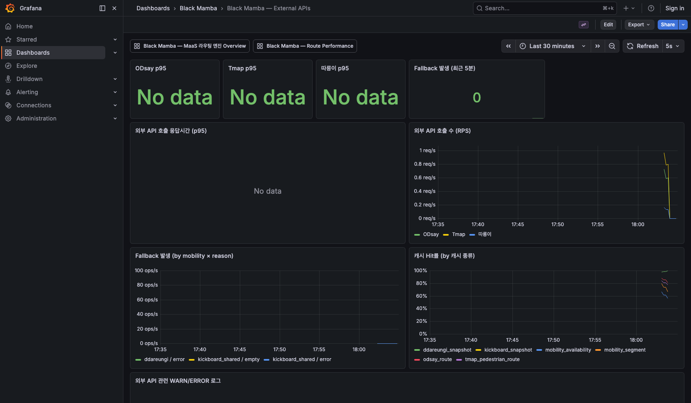
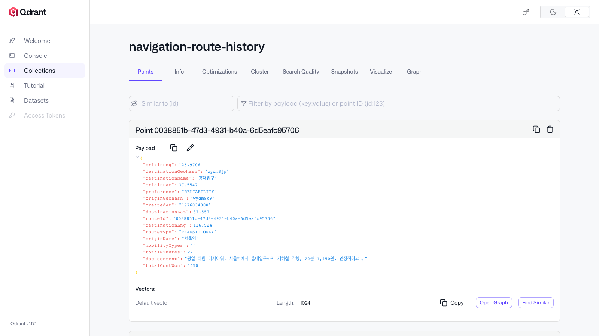
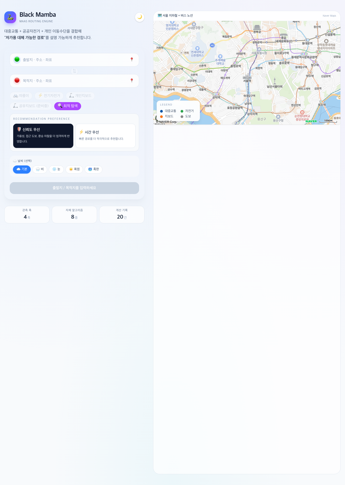
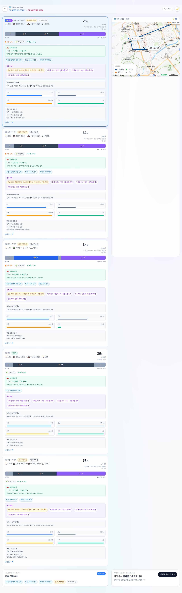
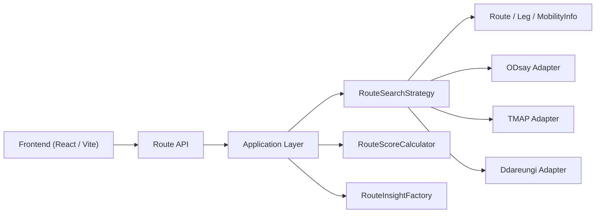
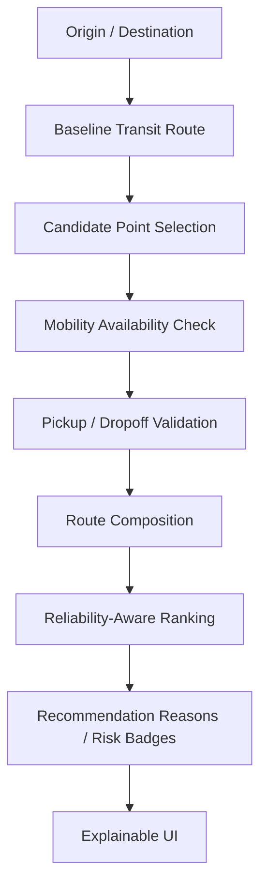

# Black Mamba — AI 기반 MaaS 라우팅 엔진

[](https://github.com/OldTemple91/black-mamba/actions/workflows/ci.yml)
[](https://openjdk.org/projects/jdk/21/)
[](https://spring.io/projects/spring-boot)
[](https://docs.spring.io/spring-ai/reference/)
[](https://resilience4j.readme.io/)
[](docs/monitoring/observability-stack.md)

대중교통 + 공공자전거 + 개인 이동수단 멀티모달 경로 엔진에,
**Spring AI 기반 RAG 파이프라인 / Reactor 기반 SSE 실시간 스트림 / Resilience4j 장애 대응 / 3축 관측성(Logs↔Metrics↔Traces)** 을
통합한 "설명 가능한 MaaS" 포트폴리오.

## ⚡ 한눈에 보기

| 영역 | 내용 |
|------|------|
| 🧭 **자체 라우팅 알고리즘** | Baseline-Guided Recomposition (5패턴) + 2-Phase Hub Selection + 6-Dim Weighted Scoring ⋯ → [상세](docs/architecture/routing-algorithm.md) |
| 🧠 **AI/RAG (Phase 1~6)** | 자연어 경로 검색 + Qdrant 벡터 DB + bge-m3(1024차원) 하이브리드 검색 + LLM narrative + 할루시네이션 감지 |
| ⚡ **실시간 스트림 (A-1)** | Reactor Flux 기반 SSE — 30초 재탐색, 변화 감지 push, HEARTBEAT, 자동 종료 |
| 🛡️ **장애 대응 (T-3)** | Resilience4j CircuitBreaker + Retry + Fallback — 외부 API 5개 3층 방어선 |
| 🔍 **4축 관측성** | Loki(log) ↔ Tempo(trace) ↔ Prometheus(metric) + **Alertmanager(alert) + SLO/Burn Rate** + Exemplars + OTLP/gRPC |
| 🏗️ **Clean Architecture** | Hexagonal Port/Adapter, 4-module gradle (domain/application/infra/api) |
| 📊 **성능 튜닝** | Geohash 공간 캐싱 — ODsay 히트율 46.9% → 80.4% |
| 🌱 **MaaS 정체성** | 경로별 **탄소 배출량** (이동수단별 정밀 계수) + **날씨 인식** (RAIN/SNOW 공유 모빌리티 페널티) + 접근성 (휠체어/노인) |

👉 **[자체 알고리즘 카탈로그](docs/architecture/routing-algorithm.md)** / **[개선 기록 19건](docs/improvements/README.md)** / **[ADR 7건](docs/adr/)** / **[로드맵](docs/roadmap/ROADMAP.md)**

## 🧭 "무엇을 우리가 직접 만들었나" — Orchestration 층

> A\*/Dijkstra 같은 **도로 그래프 최단경로** 는 ODsay/Tmap 이 처리.
> 우리는 그 위에서 **다중 이동수단을 재조합 · 평가 · 설명하는 Orchestration 층** 을 자체 설계.

| # | 알고리즘 | 한 줄 설명 | 코드 |
|---|---------|-----------|-----|
| ① | **Baseline-Guided Multimodal Recomposition** | 순수 대중교통 baseline 을 설계도 삼아 5패턴 (A/B/C/D/E) 병렬 탐색 | `OptimalSearchStrategy` |
| ② | **Two-Phase Hub Selection** | Primary(이상 조건) → Fallback(완화 60%) — 밀집·공백 지역 대응 | `HubSelector` |
| ③ | **30~80% Candidate Window + 120m 중복 제거** | Baseline 의 중간 구간에서 후보 정류장 추출 | `CandidatePointSelector` |
| ④ | **Two-Phase Walking (Haversine → Tmap)** | 후보 필터는 직선거리로 싸게, 확정 후 Tmap 보행 API 로 정밀 | `MobilitySegmentBuilder` |
| ⑤ | **6-Dim Weighted Scoring** | time/transfer/cost/walk/accessWalk/reliability × 2 프로파일 + 7 벌점 | `RouteScoreCalculator` |
| ⑥ | **Geohash Spatial Cache (precision 7)** | 150m 격자로 좌표 양자화 → ODsay 히트율 46.9% → **80.4%** | `GeohashKeyGenerator` |
| ⑦ | **Accessibility Post-Processor** | 휠체어/노인 옵션을 라우팅 로직에 침투시키지 않고 결과 후처리로 해결 | `AccessibilityPostProcessor` |
| ⑧ | **SSE Change Detection** | 30초 폴링 + 2분 임계값 이상 변화만 UPDATE, 나머지는 HEARTBEAT | `RouteStreamService#changeReason` |

**👉 [자체 라우팅 알고리즘 카탈로그](docs/architecture/routing-algorithm.md)** — 의사코드, 임계값 근거, 성과 지표, A\*/Dijkstra를 쓰지 않은 이유 (Design Non-Goals) 포함.

## 📸 실측 증거 (Observability · Vector DB)

Docker Compose 로 전체 스택 기동 후 실측 트래픽 발생 상태에서 자동 캡처.

### Grafana — 3축 관측성 대시보드

**Overview** (요청 수 / p95 / 캐시 Hit률 / JVM)


**Route Performance** (응답시간 히트맵, 처리량 by outcome)


**External APIs** (ODsay/Tmap/따릉이 호출 + 캐시 Hit률 + Fallback)


### Qdrant — 벡터 DB 실데이터

200+ points 저장, 각 포인트에 1024차원 bge-m3 벡터 + payload (doc_content,
geohash, preference 등) 확인 가능.



> 📁 캡처 스크립트: [`scripts/screenshots/capture.mjs`](scripts/screenshots/capture.mjs)
> (Playwright 헤드리스, Docker + Ollama 기동 후 실행)

## 🎯 원래 목적: 신뢰도 중심 MaaS 라우팅

대중교통, 공공자전거, 개인 이동수단을 결합해 도착 성공 가능성이 높은 경로를 추천하는 도시형 멀티모달 라우팅 엔진입니다. 기본 `OPTIMAL` 추천은 MaaS 시나리오에 맞춰 대중교통과 공공/공유 수단 중심으로 구성하고, 개인 이동수단은 사용자가 명시적으로 선택한 경우에만 탐색합니다.

현재 실험 기준으로는 이 축을 두 개로 분리해 해석합니다.

- `OPTIMAL`:
  - 현실적인 MaaS 조합 검증
  - 대중교통 + 공공/공유 모빌리티 중심
- `SPECIFIC + PERSONAL`:
  - 사용자 보유 이동수단을 전제로 한 상한선 실험
  - 동일 비용으로 `12~20분` 단축되는 stronger case까지 확인

## Screenshots

### Main Search



### Route Recommendation — 현실 시나리오: 역이 아닌 위치 간 이동

**시나리오:** 서초동 아파트 단지(37.4850, 127.0320) → 성수 카페거리(37.5420, 127.0554)

실사용 OD 는 보통 **"역 ↔ 역"** 이 아니라 **집 / 오피스 / 카페 → 공원 / 상권** 같이 지하철역에서
수백 m ~ 1 km 떨어진 위치끼리 연결된다. 이런 조건에서 **퍼스트마일/라스트마일을 자전거로 대체**
하면 대중교통 직행 대비 시간 단축이 발생한다. 본 추천 결과가 그 증거:

| 순위 | 경로 타입 | 소요 | 추천 여부 |
|-----|----------|------|----------|
| #1 | `TRANSIT_WITH_BIKE` | **28분** | ✅ 추천 |
| #2~3 | `TRANSIT_WITH_BIKE` | 33분, 34분 | |
| **#4** | **`TRANSIT_ONLY`** | **36분** | ← 전통적 대중교통 직행 (8분 더 걸림) |
| #5 | `TRANSIT_WITH_BIKE` | 37분 | |

→ **Mixed 경로가 TRANSIT_ONLY 보다 8분 단축.** MaaS 엔진이 실사용 OD 에서 복합 경로의
가치를 추천으로 실제 제시한다는 시각적 증거.



## 1. Project Overview

기존 길찾기 서비스는 주로 최단시간 또는 최단거리 중심으로 경로를 추천합니다.
하지만 실제 도시 이동에서는 다음과 같은 제약이 존재합니다.

- 공유 이동수단은 항상 이용 가능한 것이 아님
- 환승은 아무 지점에서나 자연스럽게 일어나지 않음
- 자전거는 대여 가능 여부뿐 아니라 반납 정류소 존재 여부도 중요함
- 접근 도보가 길면 이론상 최적 경로도 실제로는 불편할 수 있음

이 프로젝트는 이런 현실 제약을 반영해, 단순 ETA가 아니라 실제 이동 성공 가능성이 높은 경로를 추천하는 MaaS 라우팅 엔진을 목표로 합니다.

## 2. Problem Statement

도시 이동은 단순히 "빠른 경로"를 찾는 문제로 끝나지 않습니다.

예를 들어:

- 대중교통만 이용하면 환승은 적지만 도보가 길 수 있음
- 자전거를 결합하면 더 빠를 수 있지만 반납 정류소가 없으면 경로가 성립하지 않음
- 이동수단 접근 도보가 길면 추천 경로라도 실제 선택 확률이 낮아짐
- 실시간 데이터 품질이 불완전하면 이론상 최적 경로가 실제로는 unusable 할 수 있음

따라서 이 프로젝트는 아래 질문을 해결하려고 합니다.

- 어디서 갈아타는 것이 현실적인가?
- 실제로 탈 수 있고 반납할 수 있는가?
- 최단시간보다 더 신뢰도 높은 경로는 무엇인가?

## 3. Core Idea

이 엔진은 두 단계로 경로를 탐색합니다.

### 1) Hub-Based Candidate Generation

대중교통 경로를 baseline으로 만든 뒤, 환승 가능성이 높은 지점과 허브를 후보로 선택합니다.

- baseline 대중교통 경로 생성
- 출발지/목적지 인근 허브 또는 환승 후보 지점 탐색
- 환승 후보 근처 이동수단 가용성 확인
- 자전거는 대여 정류소와 반납 정류소를 모두 검증

### 1.5) Baseline-Guided Multimodal Recomposition

이 프로젝트는 기존 대중교통 경로의 앞뒤 도보만 단순히 자전거로 치환하는 방식에 머무르지 않습니다.
baseline 대중교통 경로를 먼저 만든 뒤, 그 경로를 따라 퍼스트마일/라스트마일 허브 후보를 고르고 새로운 멀티모달 조합을 다시 구성합니다.

예를 들어 baseline이 아래와 같더라도:

- 도보 -> 지하철 A -> 지하철 B -> 도보

엔진은 아래 같은 조합을 만들 수 있습니다.

- 출발지 -> 자전거 -> 다른 허브 -> 버스/지하철 -> 도보

다만 현재는 모든 정류장/허브 조합을 완전 자유 탐색하지는 않습니다.
그 이유는 다음과 같습니다.

- 대중교통 부분 경로를 모든 허브 조합에 대해 다시 조회하면 ODsay/TMAP 호출 수가 급격히 증가함
- 무료 외부 API 플랜에서는 quota와 rate limit이 실제 제약이 됨
- 공유 이동수단 데이터는 품질과 실시간성이 완전하지 않아, 후보를 무한정 넓히는 것이 항상 품질 향상으로 이어지지 않음

그래서 현재 엔진은 `baseline 기반 허브 재조합` 전략을 사용합니다.
즉, baseline 대중교통 경로를 뼈대로 삼고 그 주변의 의미 있는 허브만 선택적으로 재조합해, 호출 수와 품질 사이의 균형을 맞춥니다.

### 2) Reliability-Aware Ranking

생성된 후보 경로를 시간뿐 아니라 다음 요소까지 포함해 평가합니다.

- 총 소요시간
- 총 도보 거리
- 환승 수
- 이동수단 접근 도보 길이
- 공유 이동수단 의존성
- 자전거 반납 정류소 존재 여부
- 가용성 부족 리스크

즉, "가장 빠른 경로"보다 "실제로 성공 가능성이 높은 경로"를 우선 추천하는 방향으로 설계했습니다.

## 4. Key Features

- 대중교통 baseline 경로 생성
- 대중교통 + 자전거 조합 경로 생성
- 이동수단 + 대중교통 조합 경로 생성
- 이동수단 + 대중교통 + 이동수단 조합 경로 생성
- 자전거 대여/반납 정류소 검증
- 이동수단 접근/이탈 도보 구간 반영
- 지도 마커 기반 탑승/환승 설명 UI
- 추천 이유 및 리스크 배지 제공
- 설명 가능한 추천 결과 제공

## 5. System Architecture

- `api`
  - 경로 검색 API 제공
- `application`
  - 경로 탐색 전략, 후보 생성, 점수 계산, 인사이트 생성
- `domain`
  - `Route`, `Leg`, `MobilityInfo` 등 핵심 도메인 모델
- `infra`
  - ODsay, TMAP, 따릉이 등 외부 API 연동
- `frontend`
  - 경로 비교, 지도 시각화, 추천 이유/리스크 노출


```mermaid
flowchart LR
    UI["Frontend (React / Vite)"] --> API["Route API"]
    API --> APP["Application Layer"]
    APP --> STRATEGY["RouteSearchStrategy"]
    APP --> SCORE["RouteScoreCalculator"]
    APP --> INSIGHT["RouteInsightFactory"]
    STRATEGY --> DOMAIN["Route / Leg / MobilityInfo"]
    STRATEGY --> ODSAY["ODsay Adapter"]
    STRATEGY --> TMAP["TMAP Adapter"]
    STRATEGY --> BIKE["Ddareungi Adapter"]
```

## 6. Routing Flow

### Baseline

- 출발지 -> 목적지 대중교통 경로 생성

### Candidate Generation

- baseline 경로에서 라스트마일/퍼스트마일 후보 지점 선택
- 출발지/목적지 인근 이동수단 가용성 조회
- 자전거는 실제 대여 정류소와 반납 정류소를 모두 확인
- 완전 자유 멀티모달 탐색 대신, baseline 주변 허브만 재조합해 외부 API 호출량을 제어

### Route Composition

현재 지원하는 경로 타입:

- `TRANSIT_ONLY`
- `TRANSIT_WITH_BIKE`
- `TRANSIT_WITH_KICKBOARD`
- `MOBILITY_FIRST_TRANSIT`
- `MOBILITY_TRANSIT_MOBILITY`
- `MOBILITY_ONLY`


```mermaid
flowchart TD
    A["Origin / Destination"] --> B["Baseline Transit Route"]
    B --> C["Candidate Point Selection"]
    C --> D["Mobility Availability Check"]
    D --> E["Pickup / Dropoff Validation"]
    E --> F["Route Composition"]
    F --> G["Reliability-Aware Ranking"]
    G --> H["Recommendation Reasons / Risk Badges"]
    H --> I["Explainable UI"]
```

## 7. Reliability-Aware Recommendation

이 프로젝트는 단순 최단시간 정렬이 아니라, 실제 사용 가능성까지 반영한 추천을 목표로 합니다.

현재 추천에 반영하는 요소:

- 총 소요시간
- 총 도보 거리
- 환승 횟수
- 접근 도보 길이
- 자전거 반납 정류소 존재 여부
- 공유 이동수단 의존도
- 가용성 부족 리스크

추천 결과에는 아래 정보를 함께 제공합니다.

- 왜 추천되었는지
- 어떤 리스크가 있는지
- 어떤 환승 포인트를 거치는지

## 8. Explainable UI

지도와 경로 카드에서 다음 정보를 시각적으로 제공합니다.

- 버스/지하철/자전거/킥보드/도보 구간 구분
- 마커 근처 탑승/환승 라벨
- hover/click 시 상세 정보 팝업
- 추천 이유 배지
- 리스크 배지
- 핵심 환승 포인트 요약
- 디버그 모드 기반 엔진 판단 정보

## 9. Data Sources

- 대중교통 경로: ODsay
- 도보/마이크로모빌리티 구간 좌표: TMAP
- 공공자전거 정류소 및 대여 가능 정보: 서울시 따릉이 API

## 10. API Call Optimization

무료 외부 API의 호출 제한을 고려해 아래 최적화를 적용했습니다.

- `ODsay`: 동일 출발/도착 쌍 route/time 재사용
- `ODsay`: 출발지/도착지 직선거리 700m 이하 구간은 검색을 차단하고 사용자에게 재검색을 유도
- `따릉이`: 전체 정류소 snapshot 캐시 후 반경 필터링만 재계산
- `킥보드`: 전체 기기 snapshot 캐시 후 반경 필터링만 재계산
- `TMAP`: 동일 보행 경로 캐시
- `TMAP`: 429 quota 초과 발생 시 일정 시간 외부 호출을 차단하고 haversine fallback
- `MobilityAvailability`: pickup/dropoff 조회 캐시
- `MobilityAvailability`: start/end 세그먼트 단위 캐시로 동일 pickup/dropoff 판단 재사용
- `Hub pruning`: 목적지 기준 이동수단 최대 범위를 벗어난 라스트마일 후보를 사전 제거
- `Candidate deduplication`: 서로 매우 가까운 정류소 후보는 하나로 병합
- `Same-station pruning`: 동일 정류소 대여/반납 조합은 경로 생성 전에 조기 제외
- `Fallback hub selection`: 기본 후보 구간이 비면 가장 가까운 feasible 정류소를 보조 허브로 사용

현재 TTL은 설정값으로 관리합니다.

- `navigation.cache.odsay-route-ttl-ms`
- `navigation.cache.ddareungi-snapshot-ttl-ms`
- `navigation.cache.kickboard-snapshot-ttl-ms`
- `navigation.cache.mobility-availability-ttl-ms`
- `navigation.cache.tmap-pedestrian-route-ttl-ms`
- `navigation.cache.tmap-rate-limit-backoff-ms`

캐시 효과는 `navigation.cache.total{cache=...,result=hit|miss}` metric으로 관찰할 수 있습니다.
외부 API 예외 상황은 아래처럼 처리합니다.

- `ODsay`: 짧은 구간(`<=700m`)은 `400 SHORT_DISTANCE` 응답으로 명시적으로 안내
- `TMAP`: 429 발생 시 backoff 기간 동안 API 호출 생략
- 두 경우 모두 엔진은 fallback 경로/시간 계산으로 동작을 유지

## 11. Tech Stack

### Backend Core
- **Java 21** (LTS, records / sealed interface / pattern matching 활용)
- **Spring Boot 3.5.13** + Gradle 8.14
- **Reactor** (Mono/Flux) — WebClient + 비동기 체인

### AI / RAG (Phase 1~6)
- **Spring AI 1.0.2** (ChatClient / VectorStore 추상화)
- **Ollama** — `llama3.2:3b` (Chat) + `bge-m3` (Embedding, 1024차원)
- **Qdrant v1.17** — 벡터 DB (gRPC, HNSW 인덱스, Cosine 유사도)

### 장애 대응 / 관측성
- **Resilience4j 2.2** — CircuitBreaker, Retry, Reactor Operator
- **Prometheus + Grafana 12** — Micrometer, Exemplars
- **Loki 3.7** — loki4j 2.0, structured metadata
- **Tempo 2.10** — OTLP/gRPC, Micrometer Tracing Bridge (OTel)

### Testing
- JUnit 5 + Mockito + AssertJ
- **WireMock** (ODsay 클라이언트 HTTP 레벨 통합 테스트)

### Frontend
- React + Vite + Naver Map

### External APIs
- ODsay (대중교통), TMAP (보행), 서울시 따릉이, 네이버 지오코딩/로컬검색

## 12. Run Locally

### 전체 스택 (권장)

```bash
docker compose up -d     # 앱 + Qdrant + Prometheus + Grafana + Loki + Tempo
```

### Backend 단독 (개발 중)

```bash
./gradlew :api:bootRun
```

### AI/RAG 기능 사용 시 사전 준비 (Ollama)

```bash
ollama pull llama3.2:3b     # 자연어 경로 파싱 + narrative (1.9GB)
ollama pull bge-m3          # 경로 임베딩 (1.2GB)
docker compose up -d qdrant # 벡터 DB
```

데모용 시드 200건 투입:
```bash
curl -X POST http://localhost:8081/api/rag/admin/seed
```

### 주요 엔드포인트

| 엔드포인트 | 설명 |
|-----------|------|
| `GET /api/routes?originLat=...` | 1회성 경로 탐색 |
| `GET /api/routes/stream?...` | **SSE 실시간 재탐색** (30초 주기) |
| `GET /api/nlp/routes?q=강남에서 홍대까지` | **자연어 경로 검색** (RAG-1) |
| `GET /api/rag/similar-routes?q=...` | **의미 유사 과거 경로** (RAG-2) |
| `GET /actuator/circuitbreakers` | **외부 API 회로 상태** (T-3) |
| `GET /actuator/prometheus` | 메트릭 스크레이프 |

### Frontend

```bash
cd frontend
npm install
npm run dev
```

기본 포트:

- backend: `8081`
- frontend: `5173`

### Load Testing (k6)

5종 부하 테스트 시나리오를 제공합니다. k6가 로컬에 없으면 Docker(`grafana/k6`) 자동 사용.

```bash
./scripts/k6/run.sh smoke    # 1 VU, 30초 — 기본 정상성
./scripts/k6/run.sh load     # 50 VU, 7분 — 평시 SLO 검증 (p95 < 2s)
./scripts/k6/run.sh stress   # 50→200 VU, 10분 — 한계 탐색
./scripts/k6/run.sh spike    # 50→300→50 VU — 급증 대응
./scripts/k6/run.sh cache    # Cold vs Warm 응답시간 비교
```

상세 기준 및 SLO: [`docs/performance/perf-baseline.md`](docs/performance/perf-baseline.md)

### Observability Stack (Prometheus + Grafana LGTM)

Metrics, Logs, Traces를 Grafana 한 곳에서 통합 조회할 수 있습니다.

```bash
docker compose up -d

# 접속
open http://localhost:3000     # Grafana (admin/admin) — 대시보드 자동 프로비저닝
open http://localhost:9090     # Prometheus
open http://localhost:3100     # Loki
open http://localhost:3200     # Tempo
```

| Phase | 스택 | 역할 |
|-------|-----|------|
| 1. Metrics | Prometheus + Micrometer | JVM/HTTP/비즈니스 메트릭 (`navigation.route.*`, `navigation.cache.*`) |
| 2. Logs | Loki + loki4j | 애플리케이션 로그 Push, `traceId` 자동 삽입 |
| 3. Traces | Tempo + Micrometer Tracing | 분산 추적 (Zipkin 포맷), 로그↔트레이스 연결 |

상세 설계: [`docs/monitoring/observability-stack.md`](docs/monitoring/observability-stack.md)
관련 기술 블로그: [모니터링 시스템 개발 (Prometheus & Grafana LGTM)](https://www.notion.so/Prometheus-Grafana-LGTM-15b8983855a3807c840addfdbe093342)

## 13. Current Implementation Status

현재 구현된 핵심 사항:

- 대중교통 경로를 baseline으로 생성
- 자전거 라스트마일/퍼스트마일 조합 경로 생성
- 실제 대여 정류소 / 반납 정류소 검증
- 이동수단 탑승 전후 도보 구간 반영
- 연속 도보 구간 병합
- 700m 이내 단거리 검색 제한 및 사용자 재검색 안내
- 추천 이유/리스크를 API 응답에 포함
- 지도/카드에서 설명 가능한 추천 UI 제공

## 14. Evaluation Plan

향후 아래 지표를 중심으로 평가할 예정입니다.

- baseline 대비 평균 시간 절감
- 평균 도보 거리 변화
- 접근 도보 평균/최대 거리
- 반납 정류소 미존재로 제외된 경로 비율
- 추천 경로의 공유수단 의존 비율
- API 응답 시간

추가로, 아래 비교를 목표로 합니다.

- 최단시간 중심 추천 vs 신뢰도 중심 추천

배치 실험 스크립트는 추천 결과뿐 아니라 cache hit/miss delta도 함께 기록합니다.

현재까지 확인된 대표 결과:

- `RELIABILITY`에서는 같은 mixed-winning 샘플 세트에서도 추천이 모두 `TRANSIT_ONLY`
- `TIME_PRIORITY`에서는 mixed-winning 샘플 7건이 모두 mixed 추천으로 전환
  - 평균 `3.857분` 단축
  - 평균 비용 변화 `-57원`
  - `MOBILITY_ONLY`, `TRANSIT_WITH_BIKE` 두 유형 모두 포함
- 최신 `no-mixed` 샘플 4건에서는 `SAME_PICKUP_DROPOFF`가 사라지고, 진단 코드가 아래처럼 수렴
  - `NO_PICKUP: 4`
  - `samplesWithMixedAlternative: 2`
- warm second-pass 기준으로는 `TMAP` miss가 `0`으로 떨어졌고, `mobility_availability`/`mobility_segment`는 세그먼트 조합 다양성 때문에 miss가 일부 남음

즉 현재 엔진은
- `RELIABILITY`: 대중교통 유지
- `TIME_PRIORITY`: 시간 절감이 실제로 있는 mixed 경로 추천

이라는 정책 차이를 실제 결과로 보여줄 수 있다.

## 15. Limitations

현재 한계:

- 공유 킥보드 실시간 데이터 미제공 (TAGO API 서울 데이터 없음 → 호출 차단, 개인 PM으로 전환)
- 허브 모델이 아직 정류소/후보점 수준에 머무름
- 점수 모델이 완전한 운영 리스크를 모두 반영하진 않음
- 실험 데이터셋 기반 정량 평가가 아직 부족함
- 700m 이내 단거리 구간은 현재 도보 전용 탐색을 제공하지 않음
- 완전 자유 멀티모달 탐색이 아니라 baseline 기반 허브 재조합이기 때문에, baseline 바깥의 유망한 허브 조합을 놓칠 수 있음
- 외부 API quota와 rate limit 때문에 후보를 무한정 확장하는 탐색은 현실적으로 어렵고, 현재는 캐시/백오프/pruning으로 대응 중
- TMAP fallback 상황에서는 도보 관련 지표가 근사치로 계산될 수 있음

## 16. Roadmap

다음 단계는 아래 방향으로 확장할 계획입니다.

### 1) Hub Domain Generalization

- `BikeStation` 수준을 넘어 `Hub` 도메인으로 일반화
- `SUBWAY_STATION`, `BUS_STOP`, `BIKE_STATION`, `CARSHARE_ZONE`, `CHARGING_STATION` 등으로 확장
- 상세 설계 문서: [`docs/plans/2026-03-11-hub-reliability-design.md`](docs/plans/2026-03-11-hub-reliability-design.md)

### 2) Reliability Score Enhancement

- 접근 도보 penalty 고도화
- 공유 이동수단 availability risk 반영
- 경로 실패 가능성 모델 강화

### 3) Automotive-Oriented Extension

- 카셰어 존을 이동수단(Leg)이 아닌 환승 거점 가중치(MobilityHub)로 활용
- 편도 카셰어(카셰어 사업자 등) 연동 시 Car → Transit → PM 완전 통합 경로 지원
- EV charging-aware routing
- PBV / mobility hub 시나리오 확장

