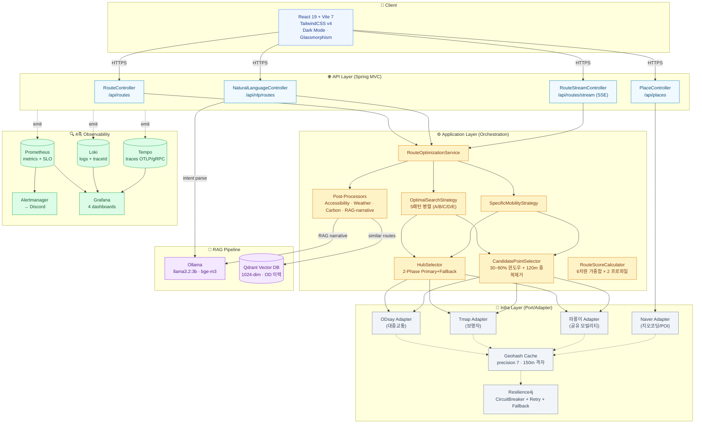
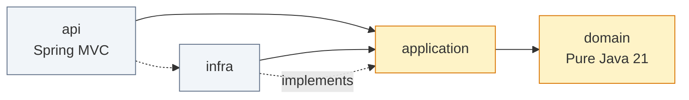
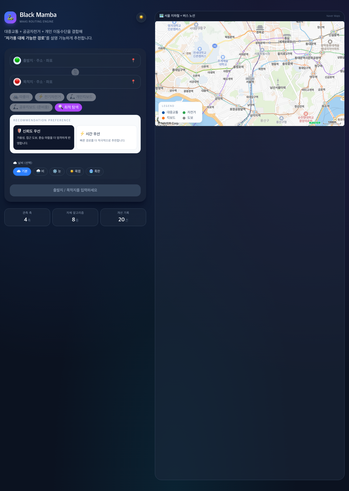
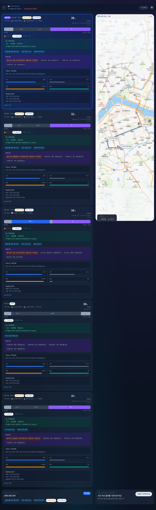
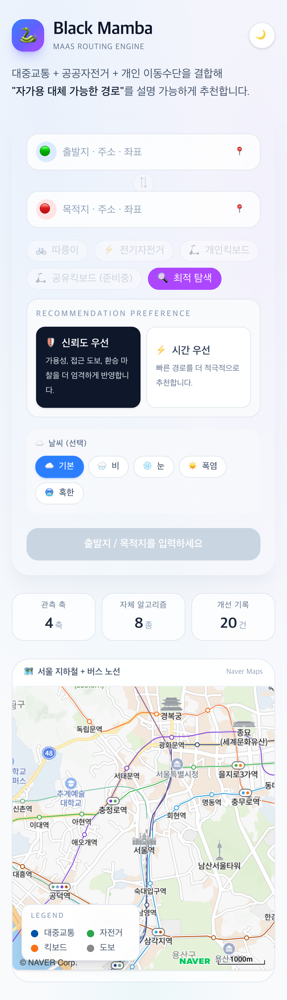
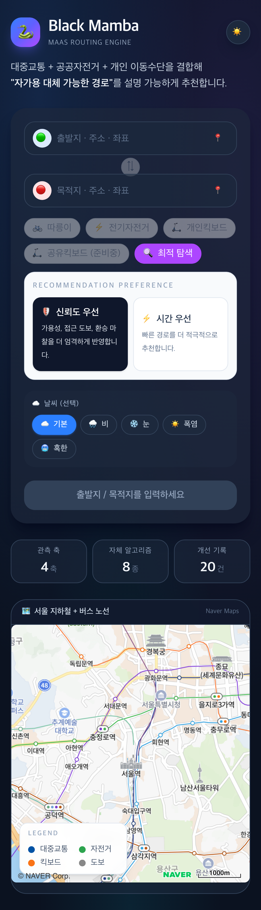

# Black Mamba — AI 기반 MaaS 라우팅 엔진

[](https://github.com/OldTemple91/black-mamba/actions/workflows/ci.yml)
[](https://openjdk.org/projects/jdk/21/)
[](https://spring.io/projects/spring-boot)
[](https://docs.spring.io/spring-ai/reference/)
[](https://resilience4j.readme.io/)
[](docs/monitoring/observability-stack.md)

대중교통 + 공유 모빌리티(따릉이·킥보드) + 개인 PM(전기자전거/킥보드)을 결합한 멀티모달 경로 엔진에,
**Spring AI 기반 RAG 파이프라인 / Reactor SSE 실시간 스트림 / Resilience4j 장애 대응 / 4축 관측성(Logs ↔ Metrics ↔ Traces ↔ Alerts/SLO)** 을 통합한 *"설명 가능한 MaaS"* 라우팅 엔진.

### 🎬 20초 데모


> 테마 토글 → 출발/목적지 입력 → 이동수단·선호도 선택 → 🌧 비 날씨 → 경로 탐색 → 결과 카드(Timeline Bar + Carbon 배지) → 카드 클릭 시 지도 연동 → 다크 모드 전환

---

## 📌 한눈에 보기 (TL;DR)

| 영역 | 내용 |
|------|------|
| 🧭 **자체 라우팅 알고리즘 8종** | Baseline-Guided Recomposition (5패턴) + 2-Phase Hub Selection + 6-Dim Weighted Scoring 등 |
| 🧠 **AI/RAG 풀 파이프라인** | 자연어 경로 검색 + Qdrant 3축 하이브리드 검색 + LLM narrative + Hallucination 자동 검증 |
| ⚡ **실시간 스트림** | Reactor Flux 기반 SSE — 30초 재탐색, 변화 감지 push, HEARTBEAT, 자동 종료 |
| 🛡️ **장애 대응** | Resilience4j 3층 방어선 (외부 API 5개) + RAG 킬 스위치 (CI 자동 검증) |
| 🔍 **4축 관측성** | Loki ↔ Tempo ↔ Prometheus + Alertmanager + SLO Burn Rate + Exemplars + OTLP/gRPC |
| 🏗️ **Hexagonal Architecture** | Port/Adapter 분리, 4-module Gradle (api / application / domain / infra) |
| 📊 **성능 튜닝** | Geohash 공간 캐시 — ODsay 히트율 46.9% → **80.4%** |
| 🌱 **MaaS 정체성** | 자가용 대비 시간·비용·CO₂ 비교 + 날씨 인식 + 휠체어 접근성 |

👉 **[자체 알고리즘 카탈로그](docs/architecture/routing-algorithm.md)** · **[Core 개선기록 14건](docs/improvements/README.md)** · **[ADR 7건](docs/adr/)** · **[로드맵](docs/roadmap/ROADMAP.md)**

---

## 1. 프로젝트 개요

서울 한정, 대중교통과 다양한 이동수단(공유 모빌리티 + 개인 PM)을 결합한 **멀티모달 경로 엔진**입니다.
기존 길찾기 서비스가 *최단시간/최단거리* 만 보는 것과 달리, 본 프로젝트는 다음과 같은 **현실 제약**을 모두 반영합니다:

- 공유 모빌리티는 항상 이용 가능한 게 아님 (재고·반납 정류소 검증 필요)
- 환승은 아무 지점에서나 자연스럽게 일어나지 않음 (허브 기반 탐색)
- 공유 자전거(따릉이 등)는 *대여 가능 여부* 뿐 아니라 *반납 정류소 존재 여부* 도 중요
- 접근 도보가 길면 *이론상 최적 경로* 도 실제로는 외면받음

→ **"가장 빠른 경로"가 아니라 "실제로 성공 가능성이 높은 경로"** 를 추천합니다.

### 누구를 위한 것인가
- 자가용 없이 도시를 이동하는 사용자
- 단일 수단(지하철·버스)만으로 닿기 어려운 *퍼스트마일·라스트마일* 까지 안내가 필요한 사용자

### 무엇이 다른가
- 단순 ETA → **6차원 신뢰도 평가** + 자가용 대비 *시간·비용·CO₂* 비교
- 닫힌 추천 → **자연어 설명** (RAG narrative + Hallucination 검증)
- 단일 응답 → **실시간 변화 감지** (SSE Push)

---

## 2. 풀려는 문제

도시 이동에서 단순 *"빠른 경로"* 만으로는 해결되지 않는 문제들:

1. **대중교통만 이용** — 환승은 적지만 *도보가 길어* 외면받기 쉬움
2. **공유 자전거 결합** — 더 빠를 수 있지만 *반납 정류소 없으면* 경로 자체가 성립 안 함
3. **이동수단 접근 도보 길이** — 추천 경로라도 *접근 자체가 불편하면* 선택 확률 ↓
4. **실시간 데이터 품질** — 이론상 최적이 *실제론 unusable* 한 케이스 존재

**핵심 질문 3가지:**
- 어디서 갈아타는 것이 *현실적*인가?
- 실제로 *탈 수 있고 반납*할 수 있는가?
- 최단시간보다 *신뢰도 높은* 경로는 무엇인가?

---

## 3. 핵심 설계

### 3.1 시스템 아키텍처


```mermaid
flowchart TB
    subgraph Client["👤 Client"]
        UI["React 19 + Vite 7<br/>TailwindCSS v4<br/>Dark Mode · Glassmorphism"]
    end

    subgraph API["🌐 API Layer (Spring MVC)"]
        RC["RouteController<br/>/api/routes"]
        NC["NaturalLanguageController<br/>/api/nlp/routes"]
        SC["RouteStreamController<br/>/api/routes/stream (SSE)"]
        PC["PlaceController<br/>/api/places"]
    end

    subgraph App["⚙️ Application Layer (Orchestration)"]
        ROS["RouteOptimizationService"]
        OS["OptimalSearchStrategy<br/>5패턴 병렬 (A/B/C/D/E)"]
        SS["SpecificMobilityStrategy"]
        HS["HubSelector<br/>2-Phase Primary+Fallback"]
        CPS["CandidatePointSelector<br/>30~80% 윈도우 + 120m 중복제거"]
        RSC["RouteScoreCalculator<br/>6차원 가중합 × 2 프로파일"]
        APP_POST["Post-Processors<br/>Accessibility · Weather · Carbon · RAG-narrative"]
    end

    subgraph Infra["🔌 Infra Layer (Port/Adapter)"]
        ODS["ODsay Adapter<br/>(대중교통)"]
        TMAP["Tmap Adapter<br/>(보행자)"]
        DDR["따릉이 Adapter<br/>(공유 모빌리티)"]
        NAV["Naver Adapter<br/>(지오코딩/POI)"]
        CACHE["Geohash Cache<br/>precision 7 · 150m 격자"]
        CB["Resilience4j<br/>CircuitBreaker + Retry + Fallback"]
    end

    subgraph AI["🧠 RAG Pipeline"]
        OLLAMA["Ollama<br/>llama3.2:3b · bge-m3"]
        QDRANT[("Qdrant Vector DB<br/>1024-dim · OD 이력")]
    end

    subgraph Obs["🔍 4축 Observability"]
        PROM[("Prometheus<br/>metrics + SLO")]
        LOKI[("Loki<br/>logs + traceId")]
        TEMPO[("Tempo<br/>traces OTLP/gRPC")]
        ALERT["Alertmanager<br/>→ Discord"]
        GRAF["Grafana<br/>4 dashboards"]
    end

    UI -->|HTTPS| RC & NC & SC & PC
    RC --> ROS
    NC -->|intent parse| OLLAMA
    NC --> ROS
    SC --> ROS
    PC --> NAV

    ROS --> OS & SS
    OS & SS --> HS & CPS
    HS & CPS --> ODS & TMAP & DDR
    ROS --> APP_POST
    APP_POST -->|RAG narrative| OLLAMA
    APP_POST -->|similar routes| QDRANT
    ODS & TMAP & DDR & NAV -.-> CACHE -.-> CB

    API -.emit.-> PROM & LOKI & TEMPO
    PROM --> ALERT
    PROM & LOKI & TEMPO --> GRAF

    classDef client fill:#eff6ff,stroke:#3b82f6,color:#1e3a8a
    classDef api fill:#f0f9ff,stroke:#0284c7,color:#0c4a6e
    classDef app fill:#fef3c7,stroke:#d97706,color:#78350f
    classDef infra fill:#f1f5f9,stroke:#64748b,color:#334155
    classDef ai fill:#f3e8ff,stroke:#9333ea,color:#581c87
    classDef obs fill:#dcfce7,stroke:#16a34a,color:#14532d
    class UI client
    class RC,NC,SC,PC api
    class ROS,OS,SS,HS,CPS,RSC,APP_POST app
    class ODS,TMAP,DDR,NAV,CACHE,CB infra
    class OLLAMA,QDRANT ai
    class PROM,LOKI,TEMPO,ALERT,GRAF obs
```

**3층 구조:**
- **L1 외부 엔진** (ODsay / Tmap / 따릉이) — 도로 그래프 · 시간표 기반 최단경로 제공
- **L2 Orchestration 층** (본 프로젝트 자체 구현) — L1 결과를 재조합해 5패턴 병렬 생성 + 2-Phase Hub + 6차원 스코어링 + 후처리
- **L3 AI + Observability** — RAG narrative · Qdrant 유사 검색 · 4축 관측성

#### 모듈 의존 (Hexagonal Architecture)


```mermaid
flowchart LR
    api[api<br/>Spring MVC] --> application
    application --> domain[domain<br/>Pure Java 21]
    infra --> application
    infra -.implements.-> application
    api -.-> infra

    classDef core fill:#fef3c7,stroke:#d97706
    classDef adapter fill:#f1f5f9,stroke:#64748b
    class domain,application core
    class api,infra adapter
```

- **domain / application** = 외부 의존성 0 (Port 인터페이스만)
- **infra** 가 Port 를 구현 (의존성 역전)
- **api** 는 application 의 유스케이스만 호출

→ 외부 API · LLM · 벡터 DB 모두 *어댑터 추가만으로 교체 가능* (예: Qdrant → Milvus, Ollama → OpenAI)

### 3.2 자체 설계 알고리즘 8종

> A\*/Dijkstra 같은 **도로 그래프 최단경로** 는 ODsay/Tmap 이 담당.
> 그 위에서 **다중 이동수단을 재조합 · 평가 · 설명하는 Orchestration 층** 을 직접 설계·구현했습니다.

| # | 알고리즘 | 한 줄 설명 | 코드 |
|---|---------|-----------|-----|
| ① | **Baseline-Guided Multimodal Recomposition** | 순수 대중교통 baseline 을 설계도 삼아 5패턴 (A/B/C/D/E) 병렬 탐색 | `OptimalSearchStrategy` |
| ② | **Two-Phase Hub Selection** | 환승점 후보를 이상적 거리로 먼저 검색, 0건이면 기준 완화해 재탐색 | `HubSelector` |
| ③ | **30~80% Candidate Window + 120m 중복 제거** | Baseline 의 중간 구간에서 후보 정류장 추출 | `CandidatePointSelector` |
| ④ | **Two-Phase Walking (Haversine → Tmap)** | 후보 필터는 직선거리로 빠르게, 확정 후 Tmap 보행 API 로 정밀화 | `MobilitySegmentBuilder` |
| ⑤ | **6-Dim Weighted Scoring + 7 Penalty** | time / transfer / cost / walk / accessWalk / reliability × 2 프로파일 | `RouteScoreCalculator` |
| ⑥ | **Geohash Spatial Cache (precision 7)** | 150m 격자로 좌표 양자화 → ODsay 히트율 46.9% → **80.4%** | `GeohashKeyGenerator` |
| ⑦ | **Accessibility Post-Processor** | 휠체어/노인 옵션을 라우팅 로직 비침투, 결과에만 후처리로 적용 | `AccessibilityPostProcessor` |
| ⑧ | **SSE Change Detection** | 30초 재탐색 + 추천 경로 변경 또는 2분 이상 차이 시만 UPDATE push | `RouteStreamService#changeReason` |

→ 의사코드, 임계값 근거, A\*/Dijkstra 미채택 이유: **[자체 알고리즘 카탈로그](docs/architecture/routing-algorithm.md)**

### 3.3 AI/RAG 풀 파이프라인

> **설계 원칙** — 표준 Q&A RAG 가 *LLM 이 답변 자체를 생성* 하는 것과 달리, 본 프로젝트는 **경로 계산은 결정론 알고리즘이 책임지고, LLM 은 자연어 입력 해석 + 결과 설명만 담당** 합니다.
> *MaaS 라우팅은 시간·비용 한 자리 차이로 약속에 늦을 수 있어*, 같은 입력에 매번 답이 미세하게 달라지는 LLM 의 특성을 핵심 계산에 들이지 않은 의도적 분리.

| 단계 | 역할 |
|------|------|
| **Phase 1 — NLP 파싱** | "강남에서 홍대까지 따릉이로 빠르게" → JSON 의도(origin/destination/mobility/preference) 추출 |
| **Retrieval** | bge-m3(1024차원) 임베딩 + Qdrant 3축 하이브리드 검색 (의미 유사도 + geohash + 이동수단) |
| **Augmented** | 결정론 라우팅 결과 + 과거 사례 기반으로 시스템 프롬프트 합성 (*"제공 수치만 사용 · 추측 금지"* 가드) |
| **Generation** | 최종 추천 1개에만 LLM 호출 → 자연어 설명문 2~3문장 (별도 스레드로 격리, 본 응답에 영향 X) |
| **Hallucination 검증** | LLM 출력 숫자(분/원) 정규식 추출 → 실측과 5분/1,000원 초과 차이면 자동 폴백 |
| **다층 폴백** | LLM 타임아웃·빈약 응답까지 모두 결정론 원본으로 자동 복귀 → 본 응답 무중단 |

- **Spring AI 1.0.2** + **Ollama** (`llama3.2:3b` + `bge-m3`) + **Qdrant v1.13.6**
- 외부 OpenAI 의존 없이 자체호스팅 → **비용 0 + 데이터 외부 유출 차단**
- 운영 메트릭: `navigation.rag.narrative.{generated, fallback{reason}, similar_hit}` (Prometheus)

### 3.4 운영 안정성 + 4축 관측성

#### 외부 API 방어선

| API | 적용 | 맞춤 Fallback |
|---|---|---|
| ODsay (대중교통) | Resilience4j 3층 (Retry → CircuitBreaker → Fallback) | stale 캐시 (만료된 응답이라도 반환) |
| Tmap (보행) | 동일 | Haversine 직선거리 추정 |
| 따릉이 (정류소) | 동일 | snapshot 캐시 (마지막 정상 응답) |
| Naver Geocoding | 동일 | Naver Local 검색 폴백 |
| Naver Local | 동일 | 빈 결과 + 사용자 안내 |

추가:
- **TAGO 킬 스위치** — env 토글 한 줄로 호출 차단, 응답 500ms → <10ms (서울 미제공 대응)
- **RAG 킬 스위치** — `SPRING_AUTOCONFIGURE_EXCLUDE` + `@ConditionalOnBean` 으로 Ollama/Qdrant 부재 시에도 앱 3초 기동, 매 커밋 CI 에서 자동 검증

#### 4축 관측성 (Logs ↔ Metrics ↔ Traces ↔ Alerts/SLO)

- **Loki** (loki4j 2.0) — structured metadata, traceId 자동 삽입
- **Tempo** 2.10 — OTLP/gRPC, Micrometer Tracing Bridge
- **Prometheus** v3.11 + **Grafana** v12.4 — Exemplars 로 *p95 스파이크 → Tempo 한 클릭 점프*
- **Alertmanager** v0.28 → Discord 웹훅
- **SLO Burn Rate 다중 윈도우 알림** — Google SRE Workbook 패턴 (Fast 1h × 14.4 + Slow 6h × 6) — *짧은 윈도우(즉각 감지) + 긴 윈도우(거짓 양성 방지)* 조합
- **`@Observed` AOP** — 외부 API · RAG · 라우팅 자동 계측

---

## 4. 실측·검증

Docker Compose 로 전체 스택 기동 후 실측 트래픽 발생 상태에서 자동 캡처.

### 4.1 실사용자 시나리오 벤치마크 (A-5)

역 좌표 편향을 제거한 **실사용자 OD 30쌍** 자동 배치 실험 결과:

| 지표 | 값 |
|------|-----|
| **Mixed 경로 채택률** | **43%** (TRANSIT_ONLY 대비) |
| **평균 시간 단축** | 3.4분 |
| **최대 시간 단축** | 8분 (서초 아파트 → 성수 카페거리) |
| **아파트 출발 케이스** | **70%** Mixed 경로 승리 |

**대표 시나리오** — 서초동 아파트 (37.4850, 127.0320) → 성수 카페거리 (37.5420, 127.0554):

| 순위 | 경로 타입 | 소요 | 비고 |
|-----|----------|------|-----|
| #1 | `TRANSIT_WITH_BIKE` | **28분** | ✅ 추천 |
| #2~3 | `TRANSIT_WITH_BIKE` | 33분, 34분 | |
| #4 | `TRANSIT_ONLY` | 36분 | ← 전통적 직행 (8분 더 걸림) |
| #5 | `TRANSIT_WITH_BIKE` | 37분 | |

추천 기준별 정책:
- `RELIABILITY` (기본) — 대중교통 안정성 우선
- `TIME_PRIORITY` — Mixed 경로 적극 추천 (평균 3.9분 단축)

→ 종합 수치 및 평가 방법론: [`docs/improvements/2026-04-23-A5-real-user-benchmark.md`](docs/improvements/2026-04-23-A5-real-user-benchmark.md)

### 4.2 Grafana 4축 관측성 대시보드

**Overview** — 요청 수 / p95 / 캐시 Hit률 / JVM


**Route Performance** — 응답시간 히트맵, outcome 별 처리량


**External APIs** — ODsay/Tmap/따릉이 호출 + 캐시 Hit률 + Fallback


### 4.3 Qdrant 벡터 DB 실데이터

200+ points 저장, 각 포인트에 1024차원 bge-m3 벡터 + payload (doc_content, geohash, preference 등) 확인 가능.


> 📁 캡처 스크립트: [`scripts/screenshots/capture.mjs`](scripts/screenshots/capture.mjs) — Playwright 헤드리스, Docker + Ollama 기동 후 실행

### 4.4 UI Screenshots

#### 🌗 Light / Dark — 테마 토글로 즉시 전환

| 라이트 | 다크 |
|:--:|:--:|
|  |  |
|  |  |

> 우상단 🌙 / ☀️ 토글 · localStorage + `prefers-color-scheme` 우선순위 · 0.3s 부드러운 전환
> Tailwind v4 `@custom-variant dark (&:where(.dark, .dark *))` 전략

#### 📱 Mobile — iPhone 14 viewport

| 라이트 | 다크 |
|:--:|:--:|
|  |  |
|  |  |

> 데스크톱은 `lg:grid` split layout, 모바일은 자동 vertical stack

#### 🎨 Citymapper 스타일 Route Timeline Bar

각 경로의 구간 비율을 **서울 지하철 15개 노선 공식 색상**으로 수평 막대 분할:

```
[🚶 2' | 🚇 2호선 20' ━━━━━━━━━━━━ | 🚲 6' ]
                                     총 28분 · 3개 구간
```

---

## 5. 기술 스택

### Backend Core
- **Java 21** (LTS, records / sealed interface / pattern matching 활용)
- **Spring Boot 3.5.13** + Gradle 8.14 멀티모듈
- **Reactor** (Mono/Flux) — WebClient + 비동기 체인
- **Micrometer Observation + `@Observed`** — 트레이싱/메트릭 통합

### AI / RAG
- **Spring AI 1.0.2** (`ChatClient` / `VectorStore` 추상화)
- **Ollama** — `llama3.2:3b` (Chat) + `bge-m3` (Embedding, 1024차원)
- **Qdrant v1.13.6** — 벡터 DB (gRPC, HNSW 인덱스, Cosine 유사도, 3축 하이브리드 필터)

### 장애 대응
- **Resilience4j 2.2** — CircuitBreaker + Retry + Fallback (Reactor Operator)
- 외부 API 5개 (ODsay / Tmap / 따릉이 / Naver Geocoding / Naver Local) 3층 방어선
- **TAGO 킬 스위치** (`tago.enabled` env 토글)
- **RAG 킬 스위치** (`SPRING_AUTOCONFIGURE_EXCLUDE` + `@ConditionalOnBean`)

### 관측성 (4축)
- **Prometheus v3.11** + **Grafana v12.4** — Micrometer, Exemplars
- **Loki 3.7** — loki4j 2.0, structured metadata (stack_trace 펼치기)
- **Tempo 2.10** — OTLP/gRPC, Micrometer Tracing Bridge (OTel)
- **Alertmanager v0.28** — Discord 웹훅 + SLO Burn Rate (Google SRE 패턴)
- **cAdvisor v0.55** + **Node Exporter v1.9** — 호스트/컨테이너 메트릭

### MaaS 정체성
- **Carbon Footprint** — 이동수단별 정밀 계수 (지하철 41 / 버스 68 / 공유 킥보드 22 g/km)
- **Weather-aware Routing** — RAIN/SNOW 시 공유 모빌리티 페널티 (후처리 패턴 재사용)
- **Accessibility** — 휠체어/노인 옵션 (엘리베이터 없는 역 필터 + 보행속도 재계산)
- **vs 자가용 비교** — 시간/비용/CO₂ 3축 narrative

### Frontend
- **React 19** + **Vite 7** + **TailwindCSS v4**
- **Naver Maps** — 실시간 경로 라인 (passThroughStations 기반 경유 정류장 연결)
- **Dark Mode** — localStorage + `prefers-color-scheme` 우선순위
- **Route Timeline Bar** — 서울 지하철 15개 노선 공식색
- **Skeleton Loading** + **Glassmorphism** + **Hero CSS motion** + `prefers-reduced-motion` 대응

### Testing
- **JUnit 5** + Mockito + AssertJ — 단위 테스트 88개
- **WireMock** — ODsay 클라이언트 HTTP 통합 테스트
- **Playwright** — 프론트 UI 자동 스크린샷 + 데모 비디오 녹화

### External APIs
- **ODsay** (대중교통), **TMAP** (보행), 서울시 **따릉이**, **네이버** 지오코딩/로컬, **기상청** 예보 (선택)

---

## 6. 로컬 실행

### 6.1 전체 스택 (권장)

```bash
docker compose up -d     # 앱 + Qdrant + Prometheus + Grafana + Loki + Tempo
```

### 6.2 백엔드 단독 (개발 중)

```bash
./gradlew :api:bootRun
```

### 6.3 AI/RAG 사용 시 사전 준비 (Ollama)

```bash
ollama pull llama3.2:3b     # 자연어 파싱 + narrative (1.9GB)
ollama pull bge-m3          # 경로 임베딩 (1.2GB)
docker compose up -d qdrant # 벡터 DB
```

데모용 시드 200건 투입:
```bash
curl -X POST http://localhost:8081/api/rag/admin/seed
```

### 6.4 RAG 킬 스위치 (장애 시 서비스 지속)

Qdrant/Ollama 장애 발생 시 **환경변수 한 줄로 RAG 없이 앱 기동** 가능:

```bash
SPRING_PROFILES_ACTIVE=docker,no-rag docker compose up -d app
```

**영향:**
- ✅ `/api/routes`, `/api/routes/stream`, `/api/nlp/routes`, `/api/places` — 완전 정상
- ⚠️ 추천 경로 `narrative` → LLM 설명 대신 **템플릿 narrative** 폴백
- ❌ `/api/rag/similar-routes`, `/api/rag/admin/seed` → `503` 또는 스킵 메시지

→ 외부 의존성(Qdrant/Ollama)이 핵심 서비스(라우팅)를 끌어내리지 않도록 설계. 상세: [`application-no-rag.yml`](api/src/main/resources/application-no-rag.yml)

### 6.5 부하 테스트 (k6)

5종 시나리오 — k6 가 로컬에 없으면 Docker(`grafana/k6`) 자동 사용:

```bash
./scripts/k6/run.sh smoke    # 1 VU, 30초 — 기본 정상성
./scripts/k6/run.sh load     # 50 VU, 7분 — 평시 SLO (p95 < 2s)
./scripts/k6/run.sh stress   # 50→200 VU, 10분 — 한계 탐색
./scripts/k6/run.sh spike    # 50→300→50 VU — 급증 대응
./scripts/k6/run.sh cache    # Cold vs Warm 응답시간 비교
```

상세 기준 및 SLO: [`docs/performance/perf-baseline.md`](docs/performance/perf-baseline.md)

### 6.6 관측성 스택 접속

```bash
docker compose up -d

open http://localhost:3000     # Grafana (admin/admin) — 대시보드 자동 프로비저닝
open http://localhost:9090     # Prometheus
open http://localhost:3100     # Loki
open http://localhost:3200     # Tempo
```

| Phase | 스택 | 역할 |
|-------|-----|------|
| 1. Metrics | Prometheus + Micrometer | JVM/HTTP/비즈니스 메트릭 (`navigation.route.*`, `navigation.cache.*`) |
| 2. Logs | Loki + loki4j | 애플리케이션 로그 Push, `traceId` 자동 삽입 |
| 3. Traces | Tempo + Micrometer Tracing | 분산 추적 (Zipkin 포맷), 로그↔트레이스 연결 |

상세 설계: [`docs/monitoring/observability-stack.md`](docs/monitoring/observability-stack.md)
관련 기술 블로그: [모니터링 시스템 개발 (Prometheus & Grafana LGTM)](https://www.notion.so/Prometheus-Grafana-LGTM-15b8983855a3807c840addfdbe093342)

### 6.7 주요 엔드포인트

| 엔드포인트 | 설명 |
|-----------|------|
| `GET /api/routes?originLat=...` | 1회성 경로 탐색 |
| `GET /api/routes/stream?...` | **SSE 실시간 재탐색** (30초 주기) |
| `GET /api/nlp/routes?q=강남에서 홍대까지` | **자연어 경로 검색** |
| `GET /api/rag/similar-routes?q=...` | **의미 유사 과거 경로** |
| `GET /actuator/circuitbreakers` | **외부 API 회로 상태** |
| `GET /actuator/prometheus` | 메트릭 스크레이프 |

### 6.8 Frontend

```bash
cd frontend
npm install
npm run dev
```

기본 포트 — backend: `8081`, frontend: `5173`

---

## 7. 한계와 로드맵

### 현재 한계

- **완전 자유 탐색이 아닌 baseline 기반 재조합** — 외부 API quota/rate limit 때문에 전수 탐색 대신 캐시·백오프·pruning 으로 품질과 호출량 균형
- **허브 모델이 정류소/후보점 수준** — `Hub` 도메인 일반화 예정 (SUBWAY_STATION, BIKE_STATION, CARSHARE_ZONE, CHARGING_STATION 등)
- **점수 모델이 운영 리스크 부분 반영** — 현재 7가지 페널티. 사용자 클릭 로그 기반 가중치 학습은 Phase 2
- **700m 이내 단거리 구간은 도보 전용 미제공** — `400 SHORT_DISTANCE` 명시적 안내
- **공유 킥보드 실시간 데이터 미제공** — TAGO 서울 데이터 없음. `TAGO_ENABLED=false` 로 외부 호출 스킵, 제공 시작 시 env 한 줄로 복구 가능 ([T-7](docs/improvements/2026-04-23-T7-tago-kill-switch.md))
- **TMAP 429 시 도보 지표 근사치** — 백오프 동안 Haversine fallback 으로 서비스 유지
- **RAG narrative 는 로컬 LLM (llama3.2:3b) 기준** — 모델 교체는 env 한 줄, 상용 LLM(GPT-4/Claude) 연동도 Spring AI `ChatClient` 추상화로 설정 레벨 전환 가능

### 향후 로드맵

#### 1) Hub Domain Generalization
- `BikeStation` 수준 → `Hub` 도메인으로 일반화
- `SUBWAY_STATION`, `BUS_STOP`, `BIKE_STATION`, `CARSHARE_ZONE`, `CHARGING_STATION` 등으로 확장
- 상세: [`docs/plans/2026-03-11-hub-reliability-design.md`](docs/plans/2026-03-11-hub-reliability-design.md)

#### 2) Reliability Score Enhancement
- 접근 도보 페널티 고도화
- 공유 이동수단 가용성 risk 반영
- 경로 실패 가능성 모델 강화

#### 3) Automotive-Oriented Extension
- 카셰어 존을 이동수단(Leg)이 아닌 환승 거점 가중치(MobilityHub)로 활용
- 편도 카셰어 연동 시 Car → Transit → PM 완전 통합 경로 지원
- EV charging-aware routing
- PBV / mobility hub 시나리오 확장

#### 4) RAG 표준 영역 확장
- 같은 인프라(Qdrant · Ollama · `@Observed`)에 어댑터 추가만으로 **Q&A · multi-turn 대화 · 사용자별 개인화 추천** 등 표준 RAG 영역까지 확대

---

## 📚 더 알아보기

- **[자체 알고리즘 카탈로그](docs/architecture/routing-algorithm.md)** — 의사코드, 임계값 근거, A\*/Dijkstra 미채택 이유
- **[Core 개선기록 14건](docs/improvements/README.md)** — 각 개선마다 배경 → 설계 → 구현 → 검증
- **[ADR 7건](docs/adr/)** — WebClient on MVC, OTLP gRPC, Baseline-Guided Recomposition 등 핵심 의사결정
- **[로드맵](docs/roadmap/ROADMAP.md)**
- **[프로젝트 설명](docs/resume/)**
